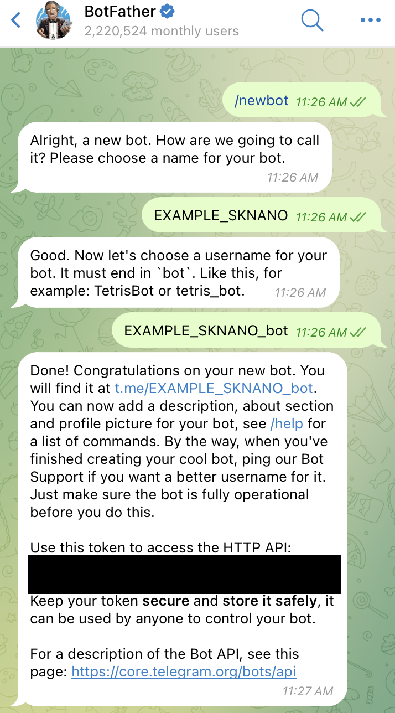

# Getting Started
## Important Notes
Before starting your main part of your analysis, ***PLEASE SKIM YOUR SAMPLES!***
The main bottleneck of SNU Server is the I/O. In most cases, the fraction of the event that pass the baseline selection is very small(for semileptonic $t\bar t$ analysis $\sim 10-20$%), Thus, it will make unnecessary I/O if you don't skim your samples.

And also will described later, you can submit the job with regex. if you skim the samples, you can use the regex to submit all the samples that desired in your analysis, by only one command like
```bash
SKNano.py -a ExampleRun -i '[YOUR_PREFIX]*' -e 2022 -n 10 --reduction 10 ...
```

## Index

- [Getting Started](#getting-started)
  - [Important Notes](#important-notes)
  - [Index](#index)
  - [Setting up the environment](#setting-up-the-environment)
    - [Preliminary Setup](#preliminary-setup)
      - [Making config file](#making-config-file)
      - [Using conda](#using-conda)
      - [Using micromamba](#using-micromamba)
      - [Using cvmfs](#using-cvmfs)
      - [Setting up ssh-key for gitlab.cern.ch (required for jsonpog-integration)](#setting-up-ssh-key-for-gitlabcernch-required-for-jsonpog-integration)
  - [Installation](#installation)
      - [About LHAPDFs](#about-lhapdfs)
      - [About correctionlibs](#about-correctionlibs)
      - [Singularity Support](#singularity-support)
      - [Check modules](#check-modules)
  - [How to Submit the job](#how-to-submit-the-job)
  - [Setting the telegram bot](#setting-the-telegram-bot)

## Setting up the environment
### Preliminary Setup
#### Making config file
Your configuration file should be named as `config/config.$USER`. You can copy the default configuration file and modify it.
- [SYSTEM]: OS that you are using. `osx / redhat`
- [PACKAGE]: Package manager that you are using. `conda / mamba / cvmfs(deprecated)`
- [TOKEN\_TELEGRAMBOT]: Token for the telegram bot. refer to [Setting the telegram bot](#setting-the-telegram-bot)
- [USER\_CHATID]: Your Chat ID that should be used for the telegram bot. refer to [Setting the telegram bot](#setting-the-telegram-bot)
- [SINGULARITY\_IMAGE]: Singularity image that you want to use for the batch job. If you don't want to use singularity, just leave it as empty. refer to [Singularity Support](#singularity-support) for more information.

#### Using conda
Here is an example to setup the environment using conda.
```bash
# create conda environment
conda create -n nano python=3.12 root=6.32.02 -c conda-forge
conda activate nano

# Install onnxruntime-cpp and correctionlib
# NOTE: Using pip to install dependencies is not recommended. Might cause the confusion while compiling the project.
conda install onnxruntime-cpp correctionlib
```

#### Using micromamba
I recommend to use micromamba, which is a faster alternative to anaconda that is infamous for its slow speed to solving the environment.
```bash
"${SHELL}" <(curl -L micro.mamba.pm/install.sh)
```
Then, you can create the environment using micromamba, just replace `conda` with `micromamba`.

For both `micromamba` and `conda`, Do not install the packages in home directory. It is because home directory cannot be accessed by the worker nodes. Use `/data6/Users/foo` instead.

If you are choose to use `micromamba` set your `[PACKAGE]` as `mamba` in the config file.
you can copy my environment by use `Nano.yml` under `docs` directory. Just Change the `prefix` to your own directory.
```bash
# @ $SKNANO_HOME/docs
# After modifying the prefix in Nano.yml (repalce [YOURNAME] in file)
micromamba env create -f Nano.yml
```

#### Note on using OSX
If you are testing your jobs on MacOS, you can use both conda and mamba environment. However, you should be cautious about the python version.
- Latest ROOT from homebrew is 6.32.08. The pre-compiled version run smoothly wiht python 3.12, but correctionlib only supports up to python 3.12.
- Possible solution is to use the conda / mamba environment with python 3.11 or 3.12 and install root from source. Here are some steps to install ROOT manually and link onnxruntime libraries.
```bash
# install mamba
brew install micromamba # follow the instruction to add the path to your shell
mamba create -n Nano python=3.12
mamba activate Nano
mamba install correctionlib onnxruntime-cpp -c conda-forge

# install root
# As Nano environment is activated, pyROOT will be binded to the python in Nano environment.
cd ~/Downloads
git clone --branch latest-stable --depth=1 https://github.com/root-project/root.git root_src
# I've installed mamba in my home directory. Let's install ROOT inside the mamba directory.
cd ~/mamba
mkdir root_build root_install
cd root_build
cmake -DCMAKE_INSTALL_PREFIX=$HOME/mamba/root_install -Dbuiltin_glew=ON  $HOME/root_src
cmake --build . --target install -j8 # takes some time
rm -rf ~/Downloads/root_src ~/mamba/root_build

# link the libraries.
# I have already installed onnxruntime-cpp in my mamba environment named Nano
ln -s $HOME/mamba/envs/Nano/lib/libonnxruntime.1.20.1.dylib $HOME/mamba/root_install/lib/libonnxruntime.1.20.1.dylib

# We do not set-up root while setup.sh. Activate root when you open the shell.
echo "source $HOME/mamba/root_install/bin/thisroot.sh" >> ~/.zshrc
source ~/.zshrc
root -l # Test the ROOT
``` 
Tested on
- M4 Mac Mini 
- MacOS Sequoia 15.2
- python 3.12
- ROOT 6.32.08
- micromamba from homebrew

#### Using cvmfs
Deprecated.

#### Setting up ssh-key for gitlab.cern.ch (required for jsonpog-integration)
```bash
ssh-keygen -t ed25519 -C "your cern email"
```
2. Add the public key to the gitlab repository. Go to the [gitlab.cern.ch](https://gitlab.cern.ch) -> Preferences -> SSH Keys -> Add an SSH key

### Installation
Recommend to fork the repository to your account.
```bash
git clone --recurse-submodules git@github.com:$GITACCOUNT/SKNanoAnalyzer.git
git remote add upstream git@github.com:CMSSNU/SKNanoAnalyzer.git

# Checkout to your development branch
# for the main branch, it is recommended to sync with the upstream main branch to get the latest updates.
git checkout $DEVBRANCH

# create config file and edit the configuration
cp config/config.default config/config.$USER

# first time setup
source setup.sh    # you have to do this every new session. It will install lhapdf and libtorch if not installed.

# build the project
./scripts/build.sh
```

#### About LHAPDFs
For using LHAPDFHandler and PDFReweight classes, two possible options
1. install lhapdf manually.
```bash
./scripts/install_lhapdf.sh
```
It would be run automatically for the first time setup.

2. use lhapdf from cvmfs

#### About correctionlibs
In the config/config.$USER file, there is an option to choose bewteen conda and cvmfs. When configuring your environment with conda, at least ROOT and correctionlibs should be installed:
```bash
# example
conda env create -n nano python=3.12 root=6.32.02 -c conda-forge
conda activate nano
conda install -c conda-forge correctionlib
```

#### Singularity Support
If you want to use Singularity image for the batch job, first compile the project within singularity image.
```bash
singularity exec $SINGULARITY_IMAGE bash -c "source setup.sh && ./scripts/build.sh"
```
`$SINGULARITY_IMAGE` variable will be automatically parsed from `config/config.$USER` file. Use SKNano.py to submit
batch jobs:
```bash
SKNano.py -a ExampleRun -i DYJets -e 2022 -n 10 --reduction 10 --no_exec ...
```

#### Check modules
Every module(or class) can be imported both in ROOT and python
```cpp
root -l
Particle *p = new Particle;
p->SetPtEtaPhiM(30, 2.1, 1.3, 0.1);
p->SetCharge(1);
p->Print()
```

```python
python
from ROOT import Particle
p = Particle()
p.SetPtEtaPhiM(30, 2.1, 1.3, 0.1)
p.SetCharge(1)
p.Print()
```

For testing other modules and analyzers, check scripts/test.py

## How to Submit the job
Jobs can be submitted to htcondor using SKFlat.py
```bash
SKFlat.py -a AnalyzerName -i SamplePD -n number of jobs -e era
```

Basic usage is as aboves. There are some additional options for the submission:
- -i: You can pass the sample PD using this option. This option supports the basic regex, thus,
  ```bash
  SKFlat.py -a Vcb_FH -i 'ST*' -n 100 -e 2022EE
    ```
    will submit the jobs for all the samples starting with 'ST' in the sample list. Thus, please be careful when you adding the new samples to the sample list.
- -n: Number of jobs to submit. If you want to submit 100 jobs, you can use -n 100.
  You can also choose to set the ***number of files for each job***. To do this, pass this argument as negative value. For example, -n -10 will submit 10 files per job. For example, if *TTLJ_powheg* sample has 1700 files, 
  ```bash
    SKFlat.py -a Vcb_FH -i TTLJ_powheg -n -10 -e 2022EE
    ```
    will submit 170 jobs with 10 files each to cluster.
- -e: Era of the sample. You can also pass the multiple eras using comma. For example, -e 2022EE,2023 will submit the jobs for the samples in 2022EE and 2023 era.
- -r: This argument set the run. choose Run2 or Run3. This option overrids the -e option.
- --reduction: perform reduction by factor of input number. 
- --memory: set the memory for the job. Default is 2GB.
- --ncpu: set the number of cpus for the job. Default is 1.
- --userflags: set the user flags for the job. Default is empty. to set multiple flags, use comma. e.g. --userflags flag1,flag2
- --batchname: set the batch name for the job. Default is the analyzer name_userflags.
- --skimming\_mode: by passing this flag, SKFlat.py will submit the jobs for the skimming mode. Detailed information as follows.


### Skimming mode
By passing --skimming\_mode, SKFlat.py will submit the jobs for the skimming mode. In this mode, the jobs will create the output in `$SKNANO_RUN[2,3]_NANOAODPATH/Era/[Data,MC]/Skim/$USERNAME` directory, Instead of submit hadd layer in DAG, *PostProc* layer will add in the DAG. 

If your analyzer has name that starts with "Skim_", you will be asked to be enable the skimming mode. If you choose to enable the skimming mode, then skimming mode will be activated. Of course you can manually activate the skimming mode by passing --skimming\_mode flag.

PostProc layer will create the Skimmed sample folder and will creat the skimTreeInfo.json file and dedicated json that saves the information of the skimmed samples under $SKNANO\_DATA/era/Sample/Skim directory.
Each postproc job modify the skimTreeInfo.json sequentially, so ***DO NOT SUBMIT THE MULTIPLE DAG CLUSTERS THAT DO SKIMMING.*** After all the postproc jobs are done, you can submit the new jobs that using skimmed sample. A prefix of Skim_AnalyzerName will be added to the output file name.
```bash
SKFlat.py -a AnalyzerName -i DYJets -n -1 -e era --skimming_mode
```
or 
```bash
SKFlat.py -a Skim_AnalyzerName -i DYJets -n -1 -e era
```
Will create the Skim\_AnalyzerName\_DYJets (if you choose to answer "y" in latter one).
Then you can submit the jobs by
```bash
SKFlat.py -a AnalyzerName -i Skim_AnalyzerName_DYJets -n -1 -e era
```

## Setting the telegram bot
To use the telegram bot, you need to create a telegram bot and get the token.
Search for `@BotFather` in the telegram. send `/newbot` and follow the instructions.



Save the token given by the BotFather to the `[TOKEN_TELEGRAMBOT]` in the config file.
Now we need to get the chat ID. Search for `@YOUR_BOT_NAME` in the telegram and send a message to the bot.
Then, go to the following URL to get the chat ID. First, Send a message to the bot, then go to the following URL.
```
https://api.telegram.org/bot[TOKEN_TELEGRAMBOT]/getUpdates
```
Then you can parse your chat ID as
```json
"from":{"id":YOUR_CHAT_ID...
```
