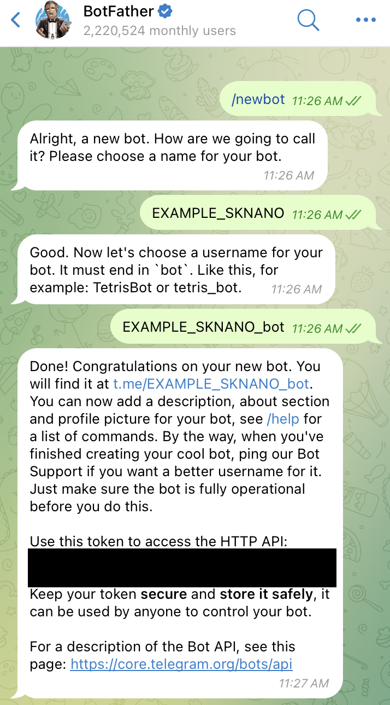

# Getting Started

[Documentation index](README.md)

## Important Notes
Skim large samples before the main analysis when the baseline keeps only a
small fraction of events. On the SNU cluster, avoidable input I/O is often the
dominant bottleneck; a semileptonic $t\bar t$ baseline may retain only
$\sim 10\text{--}20\%$ of the input.

`SKNano.py` accepts sample patterns, so a common skim prefix can be submitted
with one command:

```bash
SKNano.py -a ExampleRun -i '[YOUR_PREFIX]*' -e 2022 -n 10 --reduction 10
```

## Index

- [Important Notes](#important-notes)
- [Setting up the environment](#setting-up-the-environment)
  - [Preliminary Setup](#preliminary-setup)
  - [Installation](#installation)
- [How to Submit the job](#how-to-submit-the-job)
- [How to make a sample list](#how-to-make-a-sample-list)
- [Skimming mode](#skimming-mode)
- [Setting the Telegram bot](#setting-the-telegram-bot)

## Setting up the environment

`NanoAODv15` builds the framework and common analyzers. A branch that pins an
external analyzer module should be cloned with submodules:

```bash
git submodule update --init --recursive
source setup.sh
./scripts/build.sh --clean
```

Job submission remains unchanged because ROOT discovers installed analyzer
dictionaries automatically.

### Preliminary Setup
For Linux, the recommended environment is micromamba plus Singularity. See
[Environment Setup](SettingEnv.md) for the cluster-specific instructions.
#### Making config file
Copy `config/config.default` to `config/config.$USER`, then set the entries
needed by your environment:

- [PACKAGE]: package manager, either `conda` or `mamba`
- [TOKEN\_TELEGRAMBOT]: optional Telegram bot token
- [USER\_CHATID]: optional Telegram chat ID
- [SINGULARITY\_IMAGE]: absolute path to the Singularity image used by batch
  jobs; see [Environment Setup](SettingEnv.md#setting-up-singularity)

#### Using conda
Here is an example to setup the environment using conda.
```bash
# Solver-based fallback (Linux users should prefer the lock file below).
conda env create -f docs/Nano.yml
conda activate Nano

# ROOT, correctionlib, Abseil, ONNX Runtime, and the compiler toolchain are
# installed together from docs/Nano.yml to keep their C++ ABI compatible.

# Optional packages
pip install torch==2.4.1 --index-url https://download.pytorch.org/whl/cu121
pip install torch_geometric
pip install pyg_lib torch_scatter torch_sparse torch_cluster torch_spline_conv -f https://data.pyg.org/whl/torch-2.4.0+cu121.html
pip install numpy pandas matplotlib scipy scikit-learn captum networkx seaborn
```

#### Using micromamba
Micromamba is recommended for its fast, lightweight environment solver.
```bash
"${SHELL}" <(curl -L micro.mamba.pm/install.sh)
```
Store micromamba itself and its environment root on shared storage such as
`/data6/Users/$USER`; worker nodes cannot access the login-node home directory.
Set `[PACKAGE] mamba` in `config/config.$USER`.
On Linux x86_64, the explicit lock file is recommended. It reproduces the tested
ROOT 6.40.02, GCC 13.3, and C++20 package set without re-solving dependencies.
The local validation environment may be called `Nano640`, but the shared environment
name must remain `Nano` because `setup.sh` and batch jobs expect that name.
```bash
# Run from the SKNanoAnalyzer repository root.
micromamba create -n Nano -f docs/Nano-linux-64.lock
micromamba activate Nano
```

If an exact package URL in the lock has been retired, use the solver-based
`docs/Nano.yml` as a Linux fallback. macOS has a separate setup below.

Do not upgrade ROOT or Abseil independently in this environment. ROOT 6.40 uses
C++20 here; mixing it with the older 20220623 Abseil headers causes Cling to load
the removed `<ciso646>` header and can make every analyzer job crash at startup.

#### Note on using OSX
MacOS have some limitations on the test, especially if you are testing your machine learning workflows with GPUs. Otherwise, compiling the project and running the analyzers should be fine.
```bash
# install mamba
brew install micromamba # follow the instruction to add the path to your shell
mamba create -n Nano python=3.12 root=6.34.04 -c conda-forge
mamba activate Nano
mamba install correctionlib onnxruntime-cpp boost-cpp -c conda-forge

pip install torch==2.4.1 torch_geometric
pip install --no-build-isolation git+https://github.com/pyg-team/pyg-lib.git
pip install --no-build-isolation torch_scatter
pip install --no-build-isolation torch_sparse
pip install --no-build-isolation torch_cluster
pip install --no-build-isolation torch_spline_conv
pip install numpy pandas matplotlib scipy scikit-learn captum networkx cmsstyle
```

In the case that root is not working with conda installation, try the following steps to install ROOT from source.
```bash
# Activate the mamba environment to bind pyROOT
mamba activate Nano

# install root
# As Nano environment is activated, pyROOT will be binded to the python in Nano environment.
cd ~/Downloads
git clone --branch latest-stable --depth=1 https://github.com/root-project/root.git root_src
# I've installed mamba in my home directory. Let's install ROOT inside the mamba directory.
cd ~/mamba
mkdir root_build root_install
cd root_build
cmake -DCMAKE_INSTALL_PREFIX=$HOME/mamba/root_install -Dbuiltin_glew=ON  $HOME/root_src
cmake --build . --target install -j8 # takes some time
rm -rf ~/Downloads/root_src ~/mamba/root_build

# link the libraries.
# I have already installed onnxruntime-cpp in my mamba environment named Nano
ln -s $HOME/mamba/envs/Nano/lib/libonnxruntime.1.20.1.dylib $HOME/mamba/root_install/lib/libonnxruntime.1.20.1.dylib

# We do not set-up root while setup.sh. Activate root when you open the shell.
echo "source $HOME/mamba/root_install/bin/thisroot.sh" >> ~/.zshrc
source ~/.zshrc
root -l # Test the ROOT
``` 

Tested on
- M4 Mac Mini 
- MacOS Taeho 26.0
- python 3.12
- ROOT 6.34.04
- micromamba from homebrew

#### Using cvmfs
Deprecated.

#### Setting up ssh-key for gitlab.cern.ch (required for jsonpog-integration)
```bash
ssh-keygen -t ed25519 -C "your cern email"
```
Add the public key to the gitlab repository. Go to the [gitlab.cern.ch](https://gitlab.cern.ch) -> Preferences -> SSH Keys -> Add an SSH key

### Installation
Recommend to fork the repository to your account.
```bash
git clone --recurse-submodules git@github.com:$GITACCOUNT/SKNanoAnalyzer.git
git remote add upstream git@github.com:CMSSNU/SKNanoAnalyzer.git

# Checkout to your development branch
# for the main branch, it is recommended to sync with the upstream main branch to get the latest updates.
git checkout $DEVBRANCH

# create config file and edit the configuration
cp config/config.default config/config.$USER

# first time setup
source setup.sh    # you have to do this every new session. It will install lhapdf and libtorch if not installed.

# build the project
./scripts/build.sh
```

#### About LHAPDFs
For using LHAPDFHandler and PDFReweight classes, two possible options
1. install lhapdf manually.
```bash
./scripts/install_lhapdf.sh
```
It would be run automatically for the first time setup.

2. use lhapdf from cvmfs

#### About correctionlibs
The config file can select conda or CVMFS corrections. For conda-based builds,
install ROOT, correctionlib, Abseil, ONNX Runtime, and the compiler toolchain
together so their C++ ABIs remain compatible. The supported Linux setup is the
repository environment described above:

```bash
micromamba create -n Nano -f docs/Nano-linux-64.lock
# Solver-based fallback:
# micromamba env create -f docs/Nano.yml
```

Do not install or upgrade ROOT and correctionlib independently in this
environment.


#### Check modules
Every module(or class) can be imported both in ROOT and python
```cpp
root -l
Particle *p = new Particle;
p->SetPtEtaPhiM(30, 2.1, 1.3, 0.1);
p->SetCharge(1);
p->Print()
```

```python
python
from ROOT import Particle
p = Particle()
p.SetPtEtaPhiM(30, 2.1, 1.3, 0.1)
p.SetCharge(1)
p.Print()
```

For testing other modules and analyzers, check scripts/test.py

## How to Submit the job
Submit HTCondor jobs with `SKNano.py`:
```bash
SKNano.py -a AnalyzerName -i SamplePD -n number_of_jobs -e era
```

Important submission options are:

- `-i`: sample name, comma-separated names, a sample-list file, or a wildcard
  pattern. For example,
  ```bash
  SKNano.py -a Vcb_FH -i 'ST*' -n 100 -e 2022EE
    ```
  selects every matching sample, so inspect broad patterns before submission.
- `-n`: desired number of jobs. A negative value sets the number of files per
  job. For example, `-n -10` assigns ten files to each job:
  ```bash
  SKNano.py -a Vcb_FH -i TTLJ_powheg -n -10 -e 2022EE
    ```
- `-e`: comma-separated eras, for example `-e 2022EE,2023`.
- `-r`: `Run2`, `Run3`, or a comma-separated combination; this overrides
  `-e`.
- `--reduction`: process a reduced fraction of the input.
- `--memory`: requested memory in MiB; the default is 2048.
- `--ncpu`: requested CPU count; the default is 1.
- `--userflags`: comma-separated analyzer flags.
- `--batchname`: custom batch name.
- `--no-hadd`: skip the per-sample merge step and move the individual shards
  to `SKNANO_OUTPUT/<Analyzer>/<era>/<sample>/hists_*.root`.
- `--merge-group-size`: merge each group of this many jobs as soon as that
  group finishes, then merge the group results. This takes the bulk of the
  merge off the critical path; 100 is a good starting point. The default, 0,
  keeps one merge job that waits for the whole sample.
- `--merge-mode`: `single` writes one file per sample; `index` merges only the
  histograms and publishes `<sample>.root.chain.json` over the RNTuple shards,
  which skips the bulk copy entirely. Read those with `python/sknano_chain.py`.
- `--merge-jobs`, `--merge-cache-size`, `--merge-batch-cache-size`: merge
  throughput tuning. See [RNTuple I/O](RNTupleIO.md).
- `--skimming_mode`: enable skimming output and post-processing.

## How to make a sample list

`data/$SKNANO_VERSION/$ERA/Sample/CommonSampleInfo.json` is the only sample
metadata. There is no per-sample json: input files are *derived*, so adding a
sample is one entry.

```json
"TTLL_powheg": {
    "isMC": 1,
    "PD": "TTto2L2Nu_TuneCP5_13p6TeV_powheg-pythia8",
    "xsec": 87.31
}
```

Inputs resolve under `$SKNANO_INPUT_ROOT`, which is the one site-local piece
and lives in the environment rather than in the metadata:

| | resolved glob |
| --- | --- |
| MC | `$SKNANO_INPUT_ROOT/<era>/<PD>/**/*.root` |
| DATA | `$SKNANO_INPUT_ROOT/<era>/<alias>/*_Run<era><period>_*/**/*.root` |

A DATA entry lists its `periods`; a reprocessing period such as `I_v2` selects
the `_v2` CRAB submission and a plain `I` excludes it. Files being written right
now (`.tmp_*.root`) are never picked up.

For a production that does not follow the layout, add `path_glob` — relative to
the input root, or absolute if it starts with `/`. An explicit `path` list still
works but pins the entry to one mount, so prefer the glob.

`setup.sh` sets `SKNANO_INPUT_ROOT`; override it per user with
`[SKNANO_INPUT_ROOT] /some/other/production` in `config/config.$USER`, which is
also how you point at an older production while a new one is still filling.

Check what resolves before submitting anything:

```bash
python3 python/sampleManager.py --era $ERA --checkSamplePaths
```

Then fill in the normalisation, which every MC job divides by:

```bash
SKNano.py -a GetEffLumi -i $SAMPLENAME -e $ERA -n 10
python3 python/sampleManager.py --era $ERA --updateMcInfo
```

## Skimming mode
Passing `--skimming_mode` writes skim output below
`$SKNANO_RUN[2,3]_NANOAODPATH/Era/[DATA,MC]/Skim/$USER` and replaces the DAG's
merge layer with skim post-processing.

An analyzer name beginning with `Skim_` prompts for skimming mode; the explicit
`--skimming_mode` flag avoids the prompt. Post-processing writes the skim
metadata into the module that produced the skim, under
`<module>/<Analysis>/data/Skim/$ERA/`; point `SKNANO_SKIM_METADATA_DIR` at that
directory first. A skim belongs to an analysis, not to the backend, so it is
discovered from the module the same way module sample jsons are.

Do not run multiple skimming DAGs that update the same sample metadata at the
same time. After post-processing completes, submit the generated
`Skim_AnalyzerName_SampleName` sample normally.
```bash
SKNano.py -a AnalyzerName -i DYJets -n -1 -e era --skimming_mode
```
or 
```bash
SKNano.py -a Skim_AnalyzerName -i DYJets -n -1 -e era
```
Both commands create `Skim_AnalyzerName_DYJets`. Submit it with:
```bash
SKNano.py -a AnalyzerName -i Skim_AnalyzerName_DYJets -n -1 -e era
```

## Setting the Telegram bot

Create a bot with Telegram's `@BotFather`, send `/newbot`, and follow the
instructions.



Save the token given by the BotFather to the `[TOKEN_TELEGRAMBOT]` in the config file.
Now we need to get the chat ID. Search for `@YOUR_BOT_NAME` in the telegram and send a message to the bot.
Then, go to the following URL to get the chat ID. First, Send a message to the bot, then go to the following URL.
```
https://api.telegram.org/bot[TOKEN_TELEGRAMBOT]/getUpdates
```
Then you can parse your chat ID as
```json
"from":{"id":YOUR_CHAT_ID...
```

When both values are configured, `SKNano.py` sends an English submission summary
containing the analyzer, eras, number of jobs, cluster ID, Git revision, and master
directory. The DAG final node sends an English completion report with elapsed time,
output counts, failed nodes, common failure signatures, scheduler hold/eviction and
memory observations, and the rescue command when a retry is needed.

Telegram delivery is best-effort: a missing credential, timeout, or Telegram API
failure is written to the reporter log and never changes the analysis result. Bot
credentials are read from the personal config and are not embedded in generated DAG
scripts. Keep `config/config.$USER` readable only by your account.
